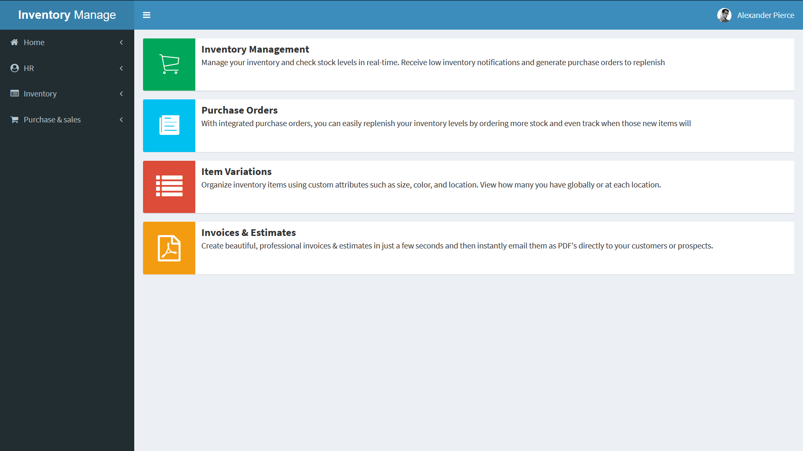

<p align="center"></p>
<p align="center">

  <a href="#">
    
  </a>
  <a href="https://github.com/kefranabg/readme-md-generator/blob/master/LICENSE">
    
  </a>
</p>

<!-- TABLE OF CONTENTS -->

## Table of Contents

- [About the Project](#about-the-project)
- [Built With](#built-with)
- [Getting Started](#getting-started)
  - [Prerequisites](#prerequisites)
  - [Installation](#installation)
- [Usage](#usage)
- [File Structure](#file-Structure)
- [Contributing](#contributing)
- [License](#license)
- [Contact](#contact)

<!-- ABOUT THE PROJECT -->

## About The Project

 

Manage your inventory and check stock levels in real-time. Receive low inventory notifications and generate purchase orders to replenish your stock.

## Built With

### Frontend
<p>
<ul>
<li>
<a href="https://getbootstrap.com/docs/3.3/">
    </a></li>
</ul>
<ul>

<li>
<a href="https://jquery.com/">
    </a>
    </li>
</ul>
</p>

### Backend

<ul>
<li>
<a href="https://www.mysql.com/">
    </a>
    </li>
</ul>


### Database

<ul>
<li>
<a href="https://www.mysql.com/">
    </a>
    </li>
</ul>

<!-- GETTING STARTED -->
## Getting Started

To get a local copy up and running follow these simple example steps.


### Prerequisites
Download [Wamp Server](http://www.wampserver.com/en/) on your Local System


### Installation

1. To install [Wamp Server](http://www.wampserver.com/en/) on your Local System read note during installation. 
2. Open php.ini file
```sh
cd C:\wamp64\bin\apache\apache2.4.39\bin\php.ini
```
3. Change short_open_tag to on in php.ini and save it.
```sh
short_open_tag = on
```
4. Change the Directory to WWW
```sh
cd C:\wamp64\www\
```
5. Clone the repo in WWW
```sh
git clone https://github.com/pranavp10/inventory
```
4. Open the Browser and paste the link, if it asks for login just give username = root and password is empty.
```sh
http://localhost/phpmyadmin/index.php
```
5. Create a database with the name
```sh
inventory
```
6. Import the file (inventory.sql) which is present in the repo
```sh
http://localhost/phpmyadmin/db_import.php?db=inventory
```
7. Open the Browser and paste the link. 
```sh
http://localhost/inventory/
```

### Hooray! 😃 done with the Installation 👏

## File Structure

```bash
├── bower_components (if using bower)
├── build
├── dist
├── images
├── pages (all php file in order of the side bar)
│   ├── hr
│   │    ├── master
│   │    │    └──...
│   │    ├── report
│   │    │    └──...
│   │    └── transaction
│   │         └──...
│   ├── Inventory
│   │    ├── master
│   │    │    └──...
│   │    ├── report
│   │    │    └──...
│   │    └── transaction
│   │         └──...
│   └── PurchaseAndsales
│   │    ├── master
│   │    │    └──...
│   │    ├── report
│   │    │    └──...
│   │    └── transaction
│   │         └──... 
├── plugins
├── scripts (all js file)
│   ├── home
│   │    └──...
│   ├── hr
│   │    └──...all file
│   ├── Inventory
│   │    └──...all file
│   └── PurchaseAndsales
│   │    └──...all file
├── LICENSE
├── check_user_name.php
├── connect.php
├── create_user.php
├── delete_user.php
├── get_home_user_id.php
├── home_users.php
├── index.php
├── inventory.sql
├── README.md
└── update_user.php
```

<!-- CONTRIBUTING -->
## Contributing

Contributions are what make the open source community such an amazing place to be learn, inspire, and create. Any contributions you make are **greatly appreciated**.

1. Fork the Project
2. Create your Feature Branch (`git checkout -b feature/AmazingFeature`)
3. Commit your Changes (`git commit -m 'Add some AmazingFeature'`)
4. Push to the Branch (`git push origin feature/AmazingFeature`)
5. Open a Pull Request


<!-- LICENSE -->
## License

Distributed under the MIT License. See `LICENSE` for more information.

<!-- CONTACT -->
## Contact

Linkedin - [Pranav](https://www.linkedin.com/in/pranav-p-241914183) - pranavkp.me@outlook.com

More Project Link: [https://github.com/pranavp10](https://github.com/pranavp10)

